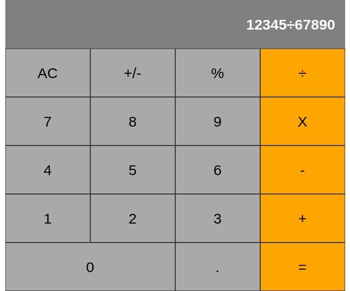

# Calculator 

## Live demo

Please [check](https://calculator.ozovalihasan.com/).

## Description

A calculator can do basic mathematical operations.

## Features

Addition, subtraction, multiplication, and division operations can be done.

## Built with

- JavaScript(ES6)
- React
- Git
- big.js
- create-react-app-buildpack

## Setup

- Clone this repository
- Open terminal
- Change directory by using `cd react-calculator/`
- Run `npm install`
- Run `npm start`
- Open a browser and go to http://localhost:3000

## Test app

To be updated.

## Authors

Reach out to me at one of the following places!

👤 **Hasan Özovalı**

- Website: [ozovalihasan.com](ozovalihasan.com)
- LinkedIn: [Hasan Ozovali](https://www.linkedin.com/in/hasan-ozovali/)
- Github: [@ozovalihasan](https://github.com/ozovalihasan)
- Twitter: [@ozovalihasan](https://twitter.com/ozovalihasan)
- Mail: [ozovalihasan@gmail.com](ozovalihasan@gmail.com)

## Contributing 🤝

Contributions, issues, and feature requests are welcome!

Feel free to check the [issues page](https://github.com/ozovalihasan/react-calculator/issues).

## Acknowledgments

Thanks to

- [Microverse](http://microverse.org/) for its support.

## Show your support

Give a ⭐️ if you like this project!

## License

- **[MIT license](http://opensource.org/licenses/mit-license.php)**
